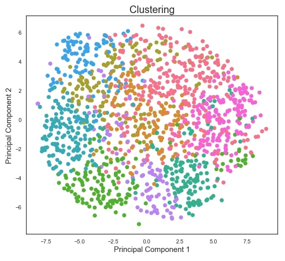

Like so many other Spotify users I find myself dumping all of my favorite songs into one massive playlist. If only there were some way to automatically make cohesive playlists out of the 1000+ songs I like to hear on Spotify. Thats how I turned to data science to inform and automate my playlist creation.

In this project, I examined the different dimensions that were offered by Spotify's API. At first I did some Exploratory Data Analysis (EDA) and made functions that would taken a given Spotify playlist and generate histograms of songs by decade and amplitude, as well as bar charts for breakdowns by artist and album. Then I discovered that Spotify's API offers a decomposition of any song into 12 abstract dimensions such as energy, danceabiltiy, and acousticness. I performed some correlation studies on the dimensions to see if they were sufficiently heteroskedastic (not correlated enough) to consider them truly distinct measures. Upon that confirmation, I was able to perform clustering methods like K-means and spectral clustering using the _sci-kit learn_ package in Python. I used 10 to be the number of distinct clusters or playlists that I wanted to be generated from the master list. By comparing the silhouette measure between these clustering techniques I could get a sense of how well they were able to partition groups of songs. I found that t-SNE provided the best classification quality being that it is able to transpose the dimensions into a higher non-linear space. 

To graph the different clustering algorithms, I used PCA to turn the 12 dimensional song data into two dimensions that could be plotted on a computer screen. The graph below shows this in action, with the different colors representing distinctly different sections of songs. To make this framework for clustering songs usable, I created a function that takes in the number of clusters and the Spotify playlist you want to split apart, performs the clustering, and pushes those playlists to Spotify for your listening consumption.

Check out the repository [here](https://github.com/jhquilty99/Spotify-Clustering).

